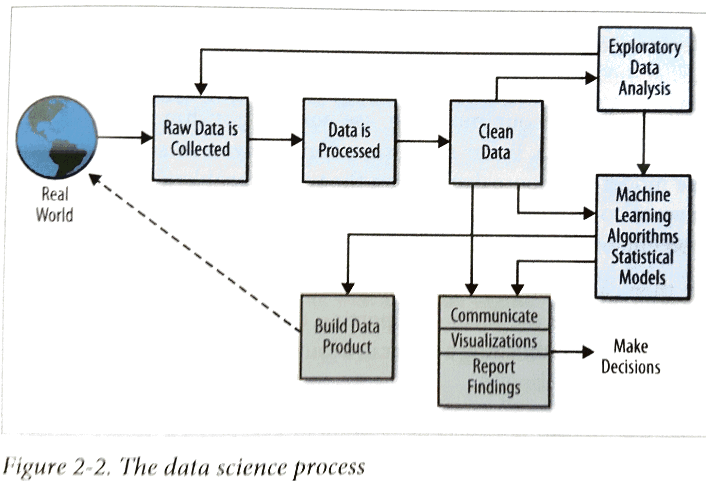

## Motivation
This project poses a pervasive social concern in a data science framework and provides insights using tools available in data science.  

## [Tools used](https://github.com/q0j0p/food/wiki/Tools-used)

## Problem definition
  Mortality is inevitable and it befalls us all, but a third of all deaths are deemed premature.  The majority of premature deaths is preventable, arising from voluntary lifestyle choices.  The World Health Organization has estimated that if the major risk factors for chronic disease were eliminated, at least 80% of all heart disease, stroke, and type 2 diabetes would be prevented, and more than 40% of cancer cases would be prevented ([ref](http://www.who.int/chp/chronic_disease_report/full_report.pdf)).  In particular, about half of all American adults have one or more preventable, diet-related chronic diseases, including cardiovascular disease, type 2 diabetes, and overweight and obesity ([ref](https://health.gov/dietaryguidelines/2015/guidelines/executive-summary/). Among the statistics of lifestyle factors related to chronic disease, early deaths due to diet and physical activity patterns stands out in the fact that has actually increased in recent years (from 14% to 18% of all early deaths, 1990 to 2010). Poor diet and activity patterns is now the leading cause of early deaths, and the direct and indirect cost of their consequences are staggering.  

The digital age proffers all kinds of products built around data, yet it is apparent that the implicit value proposition of technology-- that it serves to improve our lives-- is not fully realized when it comes to issues of health.  As a population, we make voluntary choices that make us less healthy.  Numerous, complex reasons may exist for this epidemic, but to the extent that this is a data science problem, more data science tools are necessary to address the problem.  

The USDA and DHHS have conducted surveys on "What We Eat in America (WWEIA surveys) as well as analyses on nutrient compositions of foods consumed.  These bodies of knowledge form the basis for the dietary guidelines set forth every five years ([ref](https://health.gov/dietaryguidelines/2015/guidelines/executive-summary/)).  Their current evidence-based recommendations strive to guide changes towards healthy eating patterns over time ([ref](https://health.gov/dietaryguidelines/2015/guidelines/executive-summary/#figure-es-1-2015-2020-dietary-guidelines-for-americans-at-a-glan)).  

The goal of the project is to use the variety of tools available in data science to make real world observations in dietary behavior and explore ways to empower healthy living.  Specifically, ways to help implement [the five guidelines](https://health.gov/dietaryguidelines/2015/guidelines/executive-summary/#the-guidelines) and [key recommendations](https://health.gov/dietaryguidelines/2015/guidelines/executive-summary/#key-recommendations) set forth by ODPHP will be explored.  

### Using data oriented methods to generate actionable insight  
Fundamentally, data science is about conducting scientific experimentation with data (statistics) that serves as the basis for delivering value.  The cross industry standard process for data mining ([CRISP-DM](https://en.wikipedia.org/wiki/Cross_Industry_Standard_Process_for_Data_Mining)) is a widely adopted framework.  This diagram is an illustration of the steps involved.  

### [Summary of aims](https://github.com/q0j0p/food/wiki/Assessing-the-dietary-guidelines-%5Bbusiness-understanding%5D)

## Data collection, processing, and storage

The data source of choice was allrecipes.com, an extensive website repository of recipes that is also effectively a social platform for people who cook.  It is an unpolished grass-roots website for the everyday cook ([ref](http://www.slate.com/articles/life/food/2016/05/allrecipes_reveals_the_enormous_gap_between_foodie_culture_and_what_americans.html), [ref](http://press.allrecipes.com)) [\*they have recently undergone a major commercial overhaul.]  

The website is a trove of multidimensional data.  In addition to recipe pages that contain user-generated ingredients lists, directions, pictures, metrics (cooking time, servings, nutrition information, etc.), it also contains ratings and reviews linked to members who have made and evaluated the recipe.  Each member has a personal site with sections detailing recipes that they have made or enjoyed.  Also included are list of people that they follow or are followed by.  

- [Scraping the allrecipes.com website](https://github.com/q0j0p/food/wiki/Scraping-the-allrecipes.com-website)

- [Parsing the recipes data](https://github.com/q0j0p/food/wiki/Parsing-recipe-ingredients)

The USDA maintains a database for "standard reference" foods (8,789 items) and branded food items (175,206 items) sold in the US.  These have nutrition information and the SR list is categorized.  

- [API access to USDA database](https://github.com/q0j0p/food/wiki/The-USDA-food-items-database)

## Exploratory data analysis

| **[Allrecipes member network](https://github.com/q0j0p/food/wiki/Graph-analysis-of-allrecipes.com-member-subset)** | **[ USDA food items](https://github.com/q0j0p/food/wiki/EDA-of-USDA-food-items-database)** |   
|---|---|
|| |
|  |  |  
---

## Modeling

| [Topic modeling with Latent Dirichlet Allocation](https://github.com/q0j0p/food/wiki/Topic-modeling-with-LDA) | Recommendation system for recipes |   
|---|---|
|| |
|  |  |  
